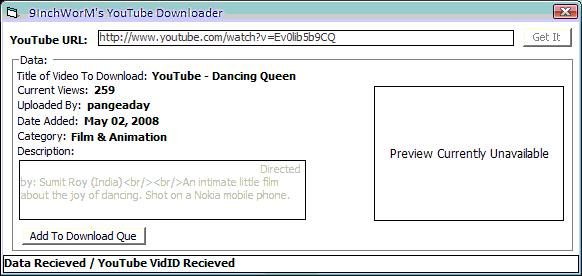



## YouTube Downloader / Parser

### Description

Gets information about a specific video, parses it and gets the vID of the video for which you can download the youtube video to your harddrive.

Will try to implement multiple downloading, and other video sharing sites.

This is part of my video downloader and converter.
 
### More Info
 

             |
---                |---
**Submitted On**   |2008-05-05 20:32:20
**By**             |[9InchWorM](https://github.com/Planet-Source-Code/PSCIndex/blob/master/ByAuthor/9inchworm.md)
**Level**          |Intermediate
**User Rating**    |5.0 (25 globes from 5 users)
**Compatibility**  |VB 6\.0
**Category**       |[Internet/ HTML](https://github.com/Planet-Source-Code/PSCIndex/blob/master/ByCategory/internet-html__1-34.md)
**World**          |[Visual Basic](https://github.com/Planet-Source-Code/PSCIndex/blob/master/ByWorld/visual-basic.md)
**Archive File**   |[YouTube\_Do2112345102008\.zip](https://github.com/Planet-Source-Code/9inchworm-youtube-downloader-parser__1-70514/archive/master.zip)

